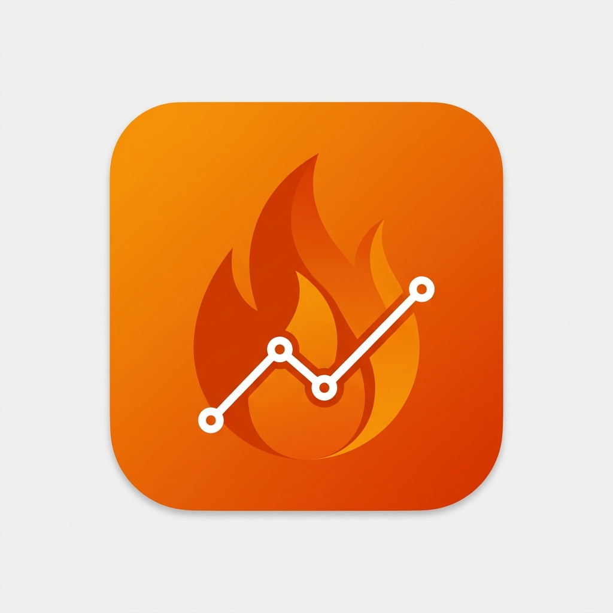

# Prometheus Dashboard for Home Assistant

<p align="center">
  
</p>

<p align="center">
  <a href="https://github.com/1orgar/ha_prom_graph/releases"></a>
  <a href="https://github.com/1orgar/ha_prom_graph/blob/main/LICENSE"></a>
  <a href="https://github.com/hacs/integration"></a>
  
</p>

Backend integration that connects Home Assistant to one or more Prometheus servers
(or compatible APIs — VictoriaMetrics, Thanos, Mimir) and proxies PromQL queries over the HA websocket API.

> 📊 **Dashboard cards** live in a separate repository:
> **[ha_prom_graph_cards](https://github.com/1orgar/ha_prom_graph_cards)** (HACS → *Dashboard*).

## ✨ Features

- 🔌 Multiple Prometheus servers, Basic Auth, optional SSL verification
- 🧪 **Test connection** button in the setup dialog — shows version, response time and targets up before saving
- 🔁 Reconfigure an existing server from the UI (also with connection test)
- 🔒 Browser never talks to Prometheus directly — all queries go through HA
- 🌍 English / Русский

## 🚀 Installation

### HACS (recommended)

1. HACS → **⋮** → **Custom repositories** → add `https://github.com/1orgar/ha_prom_graph`, type **Integration**.
2. Find **Prometheus Dashboard**, click **Download**, restart Home Assistant.
3. Install the cards: add `https://github.com/1orgar/ha_prom_graph_cards` as a **Dashboard** repository and download it.

### Manual

Copy `custom_components/prometheus_dashboard/` to `<config>/custom_components/` and restart Home Assistant.

## ⚙️ Setup

1. **Settings → Devices & services → Add integration → Prometheus Dashboard**.
2. Enter the URL (e.g. `http://192.168.1.100:9090`) and optional credentials.
3. Press **Test connection**. On success you'll see the server version, response time and targets up —
   choose **Save** or **Change settings**.

Add more servers by repeating the steps. To change a server later use **⋮ → Reconfigure** on the integration entry.

## 🧩 Websocket API

Used by the cards; `entry_id` is optional — the first configured server is used when omitted.

| Command | Parameters |
|---------|------------|
| `prometheus_dashboard/entries` | — |
| `prometheus_dashboard/query` | `query`, `time?` |
| `prometheus_dashboard/query_range` | `query`, `start`, `end`, `step` |
| `prometheus_dashboard/labels` | — |
| `prometheus_dashboard/label_values` | `label` |
| `prometheus_dashboard/series` | `match?: string[]` |
| `prometheus_dashboard/metadata` | `metric?` |

## 🖼️ Brand icon

The icon is shipped in `custom_components/prometheus_dashboard/brand/` (`icon.png`, `logo.png` and `@2x` variants).
Home Assistant ≥ 2026.3 and HACS pick it up automatically. Older HA versions only show icons from the
[home-assistant/brands](https://github.com/home-assistant/brands) repository.

## 🏗️ Architecture

```
Browser (ha_prom_graph_cards)
    ↕ WebSocket (authenticated by HA)
HA backend (this integration)
    ↕ HTTP
Prometheus server
```

## 📄 License

MIT — see [LICENSE](LICENSE).
